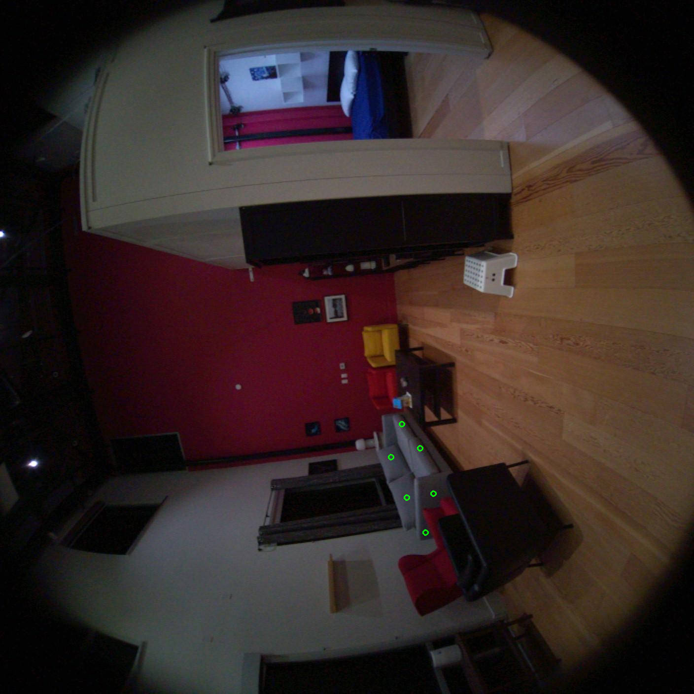
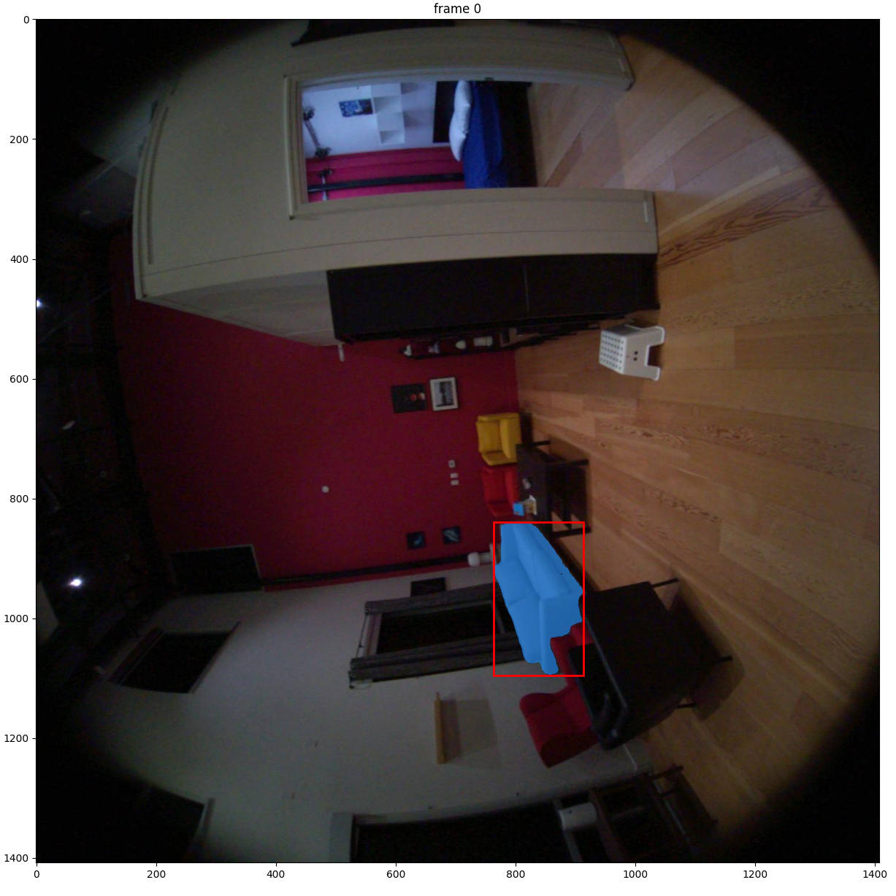
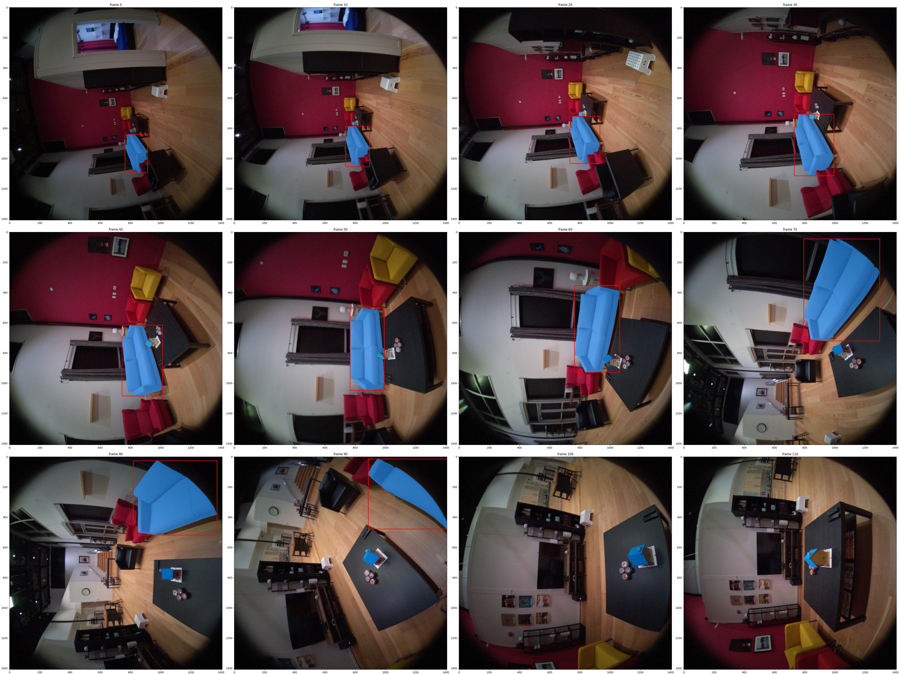

# Sample: Using SAM2 to label object masks and 2d bounding boxes in a VRS file

[SAM2](https://ai.meta.com/sam2/) is a very powerful tool that enables tracking objects in videos. This demo shows how we can use SAM2 to get labeled segmentation masks and 2D bounding boxes for a VRS file with a few simple user clicks.

## Install dependencies

Here we will summarize install instructions for both projectaria_tools, and SAM2 to be concise, but full install instructions can be found [here](https://facebookresearch.github.io/projectaria_tools/docs/data_utilities/installation/installation_python) for projectaria_tools, and [here](https://github.com/facebookresearch/sam2) for SAM2.

```
#
# Create your python environment
#
rm -rf $HOME/projectaria_tools_sam2demo_python_env
python -m venv $HOME/projectaria_tools_sam2demo_python_env
source $HOME/projectaria_tools_sam2demo_python_env/bin/activate

#
# Install or use your existing projectaria_tools
#
python -m pip install projectaria_tools

#
# Install SAM2, some dependencies, and download checkpoints
#
cd $HOME/Documents
git clone https://github.com/facebookresearch/sam2.git && cd sam2
python -m pip install -e .
python -m pip install opencv-python matplotlib
cd checkpoints && ./download_ckpts.sh
```

## Run the code sample

Running on the MPS sample VRS file:

```
cd /path_to/projectaria_tools/tools/samples/python/SAM2_vrs_object_annotation/

python SAM2_vrs_object_annotation_demo.py --vrs ../../../../data/mps_sample/sample.vrs --checkpoint $HOME/Documents/sam2/checkpoints/sam2.1_hiera_large.pt --config /$HOME/Documents/sam2/sam2/configs/sam2.1/sam2.1_hiera_l.yaml --output $HOME/Documents/sam2_demo_output
```

The script will first ask you to pick a few points, including positive and negative points (if needed):



Next, the script will display the mask generated using those prompts, and ask you to access or reject (and try again):



Finally, the script will propagate that mask through the VRS and output results + visuals:



For longer VRS files, we break up the video into segments and run the above steps for each video segment.

```bibtex
@article{ravi2024sam2,
  title={SAM 2: Segment Anything in Images and Videos},
  author={Ravi, Nikhila and Gabeur, Valentin and Hu, Yuan-Ting and Hu, Ronghang and Ryali, Chaitanya and Ma, Tengyu and Khedr, Haitham and R{\"a}dle, Roman and Rolland, Chloe and Gustafson, Laura and Mintun, Eric and Pan, Junting and Alwala, Kalyan Vasudev and Carion, Nicolas and Wu, Chao-Yuan and Girshick, Ross and Doll{\'a}r, Piotr and Feichtenhofer, Christoph},
  journal={arXiv preprint arXiv:2408.00714},
  url={https://arxiv.org/abs/2408.00714},
  year={2024}
}
```
