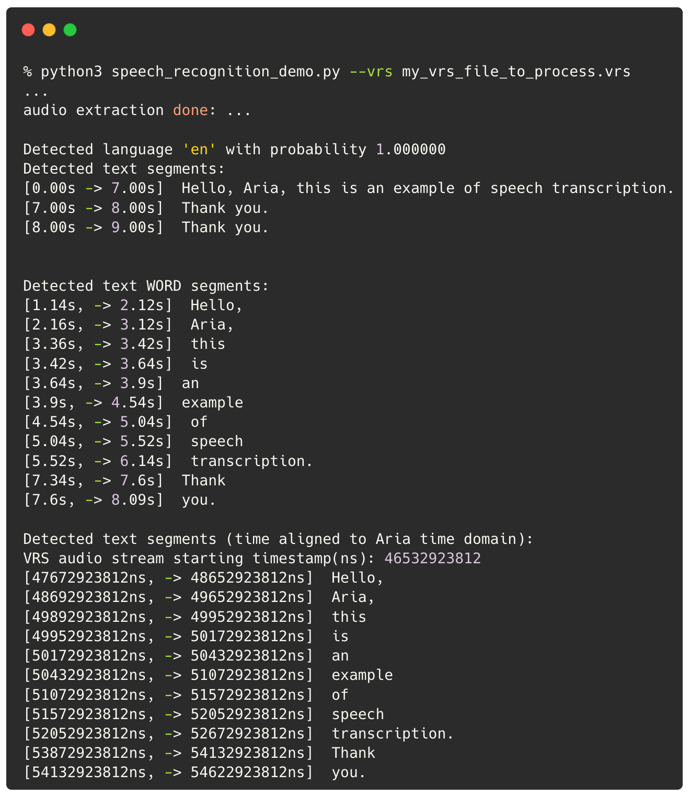

# Sample: Running Automated Speech Recognition

This sample show how to run Whisper Speech Recognition on Aria audio stream using [faster-whisper](https://github.com/SYSTRAN/faster-whisper).

## Install dependencies

```
#
# Create your python environment
#
rm -rf $HOME/projectaria_tools_python_env
python3 -m venv $HOME/projectaria_tools_python_env
source $HOME/projectaria_tools_python_env/bin/activate

#
# Install Faster Whisper
#
python -m pip install faster-whisper==0.10.0


#
# Install or use your existing projectaria_tools
#
python -m pip install projectaria_tools
```

## Run the code sample

Running on sample data (requires a VRS file):
```
python speech_recognition_demo.py --vrs <YOUR_VRS_FILE>
```

Code will:
- Extract the audio tracks from VRS
- Run Speech Recognition on the wav file
  - as sentences
  - as words
- Show how to remap the word/sentence timestamps to Aria domain
- Export the found words as a CSV file (for you to reuse easily)

Here is a preview of what the sample code output look like:



> [!NOTE]
> * Speech Recognition can output some Hallucination for SILENT moment. You can use the optional Voice Activity Detection (VAD) filter.
> * We advise you to select the output language (i.e 'en'), so it will not confuse your accent with the output language target.
