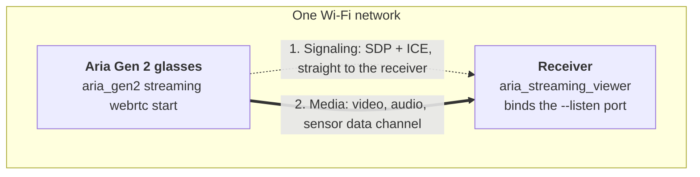
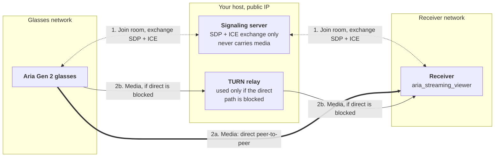

# WebRTC Streaming

Stream over **WebRTC** instead of the HTTP transport used by [USB, WiFi router and hotspot streaming](/ark/client-sdk/streaming). The receiver interface is unified — in Python you swap only the receiver class and its config (see [WebRTC Streaming Example](/ark/client-sdk/python-sdk/streaming-example#webrtc-streaming)) — and the `aria_streaming_viewer` selects the transport with `--transport {http,webrtc}` (default `http`).

## Why WebRTC

WebRTC is not simply another way to move the same bytes. It buys four things HTTP streaming does not offer:

* **Two-way audio.** WebRTC opens a bidirectional audio path: you hear the glasses, and the host microphone is sent *to* the glasses on the uplink. Nothing equivalent exists on HTTP, which is receive-only.
* **Built for low latency.** The transport is tuned for realtime delivery rather than throughput, which makes it the right choice for interactive work — teleoperation, live assistance, anything with a human in the loop reacting to what they see.
* **It crosses networks.** With a signaling server, the glasses and the receiver find each other from different networks and connect directly peer-to-peer. When NAT or a firewall blocks a direct path, a TURN server relays the media instead, so the session still works. Neither case needs an inbound port on the receiver.
* **Recording while streaming.** The glasses can capture full-rate VRS locally for the duration of the session, which is useful when the streamed profile is downscaled or the network drops frames. See [Recording While Streaming](#recording-while-streaming).

Everything else is deliberately the same: the `register_*_callback` surface and the typed sensor objects are identical to the HTTP path, so application code is unchanged across transports.

WebRTC supports two topologies:

* **[Same-network direct peer-to-peer](#same-network-direct-peer-to-peer)** — the receiver listens on a local port (`--listen`) and the glasses connect directly. No extra infrastructure required.
* **[Cross-network via a signaling server](#cross-network-signaling-server)** — the glasses and receiver rendezvous through a signaling server (with optional STUN/TURN for NAT traversal), so they can be on different networks.

## Choosing a profile

Start with **`low_latency_streaming`**. It carries the video streams at a low bitrate plus eye gaze, which is the combination that keeps latency low and the glasses thermally comfortable for a long session.

```bash
aria_gen2 streaming webrtc start \
    --profile low_latency_streaming \
    --signaling-url tcp://<this-host-ip>:9000 \
    --interface wifi_sta
```

To capture full-rate VRS on the glasses at the same time, pair it with its recording
counterpart, `low_latency_streaming_capture` — see
[Recording While Streaming](#recording-while-streaming).

WebRTC is not video-only. Alongside the camera streams it carries the same **sensor data as
HTTP** — IMU, VIO, eye gaze, hand pose, magnetometer, barometer, GPS and audio — so a
profile that enables those sensors delivers them here too. See
[What travels on which channel](#what-travels-on-which-channel) for how they are split up.

## What travels on which channel

A WebRTC session carries data over two distinct paths, and the difference is visible in the timestamps you get:

| Path | What it carries | Timestamps |
|---|---|---|
| **RTP media tracks** | The encoded camera video (RGB, SLAM, ET) and the bidirectional audio | Video is stamped with **host receive time**, expressed in the device clock |
| **Data channel** | IMU, VIO, eye gaze, hand pose, magnetometer, barometer, GPS, etc. | Native **device-clock** capture timestamps |

Encoded video is taken straight off the RTP track and bypasses the message path the other streams use, which is what makes it fast — and also what costs it its capture timestamp.

:::caution WebRTC timestamps: RTP video uses receive time (in the device clock)
On WebRTC, RTP carries no device capture timestamp, so for the **RTP video streams (RGB, SLAM, ET)** an image's `capture_timestamp_ns` is its **host receive time**, expressed in the **device clock** via an offset the client tracks from the data-channel sensors:

* Every device-stamped stream feeds the offset, so sensor-light profiles (e.g. `low_latency_streaming`, no IMU/high-freq pose) still get correctly stamped images; the 800 Hz streams take precedence when present.
* Images can be cross-correlated with the data-channel sensors, but an image timestamp is slightly late by the network/transport delay.
* The first frames of a session are held briefly until the first sensor sample establishes the offset, so no image is ever delivered in the raw host clock.
* Everything on the data channel keeps its **device-clock** timestamps.

HTTP is unchanged — every stream carries a real device capture timestamp.
:::

## Same-network (direct peer-to-peer)

On one Wi-Fi network there is no infrastructure to deploy: the receiver binds the `--listen` port and *is* the signaling endpoint, so the glasses dial it directly. The session is still negotiated the normal WebRTC way — the two peers exchange SDP and ICE candidates over that connection before any media flows. It is the same signaling protocol used against a signaling server; only the address it runs over is different.

In the diagram, the **dotted arrow is signaling** — SDP and ICE exchange, nothing else — and the **thick arrow is media**, the video, audio and sensor data channel. Media is DTLS-SRTP encrypted end to end.



Run these two commands in separate terminals, in **either order** — the viewer listens on the port and the glasses connect once streaming starts, retrying until the viewer is up. WebRTC installs no streaming certificates on the glasses, so it has none of the ordering constraint that [HTTP](/ark/client-sdk/streaming#start-order-and-streaming-certificates) has. The `--listen` port must match the port in the glasses' `--signaling-url`.

```bash
# Open the viewer over WebRTC, listening for a direct P2P connection:
aria_streaming_viewer --transport webrtc --listen 9000
# Start streaming on the glasses (in another terminal), dialing this host:
aria_gen2 streaming webrtc start --signaling-url tcp://<this-host-ip>:9000 \
    --profile low_latency_streaming --interface wifi_sta
```

:::tip Optional: a video-focused viewer layout
The SDK ships a Rerun blueprint, `aria_video_focused_rerun_0.33.rbl` — the RGB camera at the
centre, the SLAM cameras arranged around it, and eye gaze overlaid on the video streams. It
applies to any of the viewer commands on this page; the transport makes no difference:

```bash
python -m aria.extract_sdk_samples --output ~/Downloads/

aria_streaming_viewer --transport webrtc --listen 9000 \
    --blueprint ~/Downloads/projectaria_client_sdk_samples_gen2/aria_video_focused_rerun_0.33.rbl
```

See [Custom Layout with a Rerun Blueprint](/ark/client-sdk/streaming#custom-layout-with-a-rerun-blueprint)
for the other ways to load it and how to save your own.
:::

## Cross-network (signaling server)

:::info Signaling server runs on your own host
Cross-network WebRTC needs a **signaling server** to broker the initial connection. It ships as a **separate PyPI wheel** that you run on a host reachable by both the glasses and the receiver, then point `--signaling-url` (or `--signaling-host` / `--signaling-port`) at it. Same-network `--listen` peer-to-peer streaming needs no signaling server.
:::

The signaling server only introduces the peers — it passes SDP and ICE between them and then steps out of the media path. Media goes directly peer-to-peer whenever the two networks allow it. When they do not, a TURN server relays it:



```bash
aria_streaming_viewer --transport webrtc \
    --signaling-host example.com \
    --signaling-port 8443 \
    --room my-room \
    --room-password "$ROOM_PASSWORD" \
    --auth-token "$AUTH_TOKEN" \
    --stun stun:example.com:3478 \
    --turn turn:example.com:3478 \
    --turn-username aria \
    --turn-password "$TURN_PASSWORD"
```

Replace `example.com` with your own host.

Start streaming on the glasses, pointing them at the same signaling server and room:

```bash
aria_gen2 streaming webrtc start \
    --signaling-url tcp://example.com:8443 \
    --profile low_latency_streaming \
    --room my-room \
    --room-password "$ROOM_PASSWORD" \
    --auth-token "$AUTH_TOKEN" \
    --stun stun:example.com:3478 \
    --turn turn:example.com:3478,aria,"$TURN_PASSWORD" \
    --interface wifi_sta
```

### Trusting a TLS signaling server

`tcp://` signaling is plaintext. Point `--signaling-url` at an `https://` URL instead and the
signaling channel runs over TLS, so the SDP and ICE exchange, the room password and the auth
token are encrypted in transit. Media is DTLS-SRTP encrypted either way.

This is the one place WebRTC involves a certificate, and it is not a *streaming* certificate:
nothing is installed on the glasses and there is nothing to keep in sync between the two peers,
so the [HTTP start-order constraint](/ark/client-sdk/streaming#start-order-and-streaming-certificates)
still does not apply. What TLS adds is a **server** certificate on the signaling host, which each
peer has to trust:

* **Receiver** — `--ca-root` picks the trust anchor: a named root (`Public`, `MetaProd`,
  `MetaCloud`, `Test`) or a path to a PEM CA bundle. It defaults to `Public`, the system root
  store, which is what a publicly-issued certificate chains to. A self-signed or private-CA
  deployment needs `--ca-root <path-to-PEM>`.
* **Glasses** — no trust-anchor option. They accept an `https://` signaling URL only when the
  server certificate chains to a trust anchor already built into the device, so a signaling
  server the glasses reach over TLS needs a publicly-issued certificate.

```bash
aria_streaming_viewer --transport webrtc \
    --signaling-url https://example.com:8443 \
    --ca-root /path/to/ca.pem \
    --room my-room --auth-token "$AUTH_TOKEN"
```

`--no-verify-server-certs` skips verification altogether. It accepts an attacker's certificate
too, so it is rejected for anything but a loopback signaling host (`localhost`, `127.0.0.1`,
`::1`) — reach a remote self-signed deployment with `--ca-root` instead.

:::caution Glasses rejected for timestamp skew? Add `--ntp-sync`
A signaling server may reject glasses whose clock has drifted, because the
authentication handshake is timestamped and stale handshakes are refused. The glasses
never pair, and the server reports a timestamp skew error.

Add `--ntp-sync` to make the glasses sync their clock against an NTP server before the
session starts:

```bash
aria_gen2 streaming webrtc start \
    --signaling-url tcp://example.com:8443 \
    --profile low_latency_streaming \
    --room my-room --auth-token "$AUTH_TOKEN" \
    --interface wifi_sta \
    --ntp-sync
```

The glasses must be able to reach the NTP server over Wi-Fi. This is a precondition, not
best-effort: if the sync fails, the session **fails to start** rather than continuing with
an inaccurate clock. Omit the flag and no clock sync is performed — the glasses start the
session on its default time source.
:::

## Recording While Streaming

Add `-r` (`--record`) to `aria_gen2 streaming webrtc start` to record to VRS on the glasses for
the duration of the session. The live stream is unaffected — you get a full-rate on-device
capture alongside it, which is useful when the streamed profile is downscaled or the network
drops frames.

```bash
aria_gen2 streaming webrtc start \
    --signaling-url tcp://<this-host-ip>:9000 \
    --profile low_latency_streaming \
    --interface wifi_sta \
    --record --recording-profile low_latency_streaming_capture
```

`--recording-profile <name>` and `--recording-json-profile <path>` select the recording
profile — the JSON file wins if you pass both — and both require `--record`. They are separate from `--profile`, which selects the
*streaming* profile, but the two must stay compatible:

:::caution Streaming and recording profiles must be compatible
The two profiles drive the same physical sensors, so they cannot ask for conflicting
hardware configuration. **Camera quality settings — resolution, and the image format the
sensor is configured for — must match between the streaming and the recording profile.**
Frame rates may differ: recording at a higher rate than you stream is a normal and
supported combination, and is often the point of recording while streaming.

The paired pre-defined profiles above — `low_latency_streaming` and
`low_latency_streaming_capture` — already satisfy this. If you build custom profiles, derive
the recording one from the streaming one and change only the rates, or the session will fail
to start.
:::

A single `aria_gen2 streaming webrtc stop` ends the stream and the recording together;
retrieve the VRS file afterwards with
[`aria_gen2 recording download`](/ark/client-sdk/cli-reference#aria_gen2-recording-download).

From Python, set a recording config and pass `record=True`:

```python
device.set_webrtc_streaming_config(webrtc_config)
device.set_recording_config(recording_config)
device.start_streaming(record=True)
```

## Limitations

**Bandwidth is capped by thermals, and WebRTC has no batching lever to raise it.** The HTTP
transport lets you trade latency for heat with `--batch-period-ms`: messages accumulate and
go out in groups, which cuts the per-message radio overhead and is what makes long wireless
HTTP sessions thermally viable. WebRTC deliberately does not do this — batching is exactly
the latency it exists to avoid — so `aria_gen2 streaming webrtc start` has no
`--batch-period-ms`.

The practical consequence is a ceiling on how much media and sensor bandwidth a profile can
push before the glasses heat up and thermally throttle. A profile that streams
happily over HTTP with a few hundred milliseconds of batching may not be sustainable over
WebRTC.

Start with these profiles — `low_latency_streaming`, and `low_latency_streaming_capture`
alongside it when recording — which are sized for this.
If you build a custom profile, raise resolution, frame rate and sensor rates gradually and
watch the glasses' temperature across a full-length session rather than a short test.

## WebRTC Viewer Flags

These flags apply when the viewer is run with `--transport webrtc`; they are ignored on the
default HTTP transport. Every flag below except `--transport` and `--no-audio-controls` sets
the matching `WebRtcConfig` field — see [WebRtcConfig Fields](/ark/client-sdk/python-sdk/python-interface#webrtcconfig-fields) for the Python equivalents.

| Flag | `WebRtcConfig` field | Description |
|------|----------------------|-------------|
| `--transport {http,webrtc}` | *(none)* | Transport to use. Default `http`. |
| `--signaling-url <url>` | `signaling_url` | Signaling server as one `<scheme>://<host>:<port>` URL, scheme `tcp`, `https` or `http` — the same spelling the glasses take, and the only way to ask for TLS. Supersedes `--signaling-host`/`--signaling-port`. |
| `--signaling-host <host>` | `signaling_host` | Hostname of the signaling server (cross-network rendezvous), on plain TCP. Leave unset for same-network direct P2P. |
| `--signaling-port <port>` | `signaling_port` | Port of the signaling server. |
| `--ca-root <root>` | `ca_root` | Trust anchor for an `https` signaling URL: a named root (`Public`, `MetaProd`, `MetaCloud`, `Test`, matched case-insensitively) or a path to a PEM CA bundle. Default `Public`, the system root store. Inert on `tcp`. |
| `--no-verify-server-certs` | `verify_server_certificates` | Accept any signaling server certificate. Allowed only against a loopback signaling host (`localhost`, `127.0.0.1`, `::1`) — it accepts an attacker's certificate too. For a remote self-signed deployment use `--ca-root <path-to-PEM>`. |
| `--listen <port>` | `listen_port` | Local port for direct peer-to-peer connections on the same network. |
| `--stun <url>` | `stun` | STUN server URL for NAT traversal. |
| `--turn <url>` | `turn` | TURN server URL for relayed connectivity when direct/STUN fails. |
| `--turn-username <user>` | `turn_username` | Username for the TURN server. |
| `--turn-password <pw>` | `turn_password` | Credential for the TURN server. |
| `--auth-token <token>` | `auth_token` | Authentication token presented to the signaling server. |
| `--room <id>` | `room_id` | Signaling room the glasses and receiver rendezvous in. |
| `--room-password <pw>` | `room_password` | Password protecting the signaling room. |
| `--no-audio-controls` | *(none)* | Disable the terminal audio controls (see below). |

## Terminal Audio Controls

With `--transport webrtc`, the viewer prints a one-line audio control in the terminal it was launched from — this is the interactive surface for the two-way audio path:

```
Audio: press 'm' to mute/unmute the mic (CTRL+C to quit)
mic: LIVE   in [####--------------------------] 0.13
```

* `mic: LIVE` / `mic: MUTED` — press <kbd>m</kbd> to mute or unmute the microphone sent to the glasses.
* The bar and number are the level of the **incoming** audio from the glasses, refreshed about 15 times per second.

The controls are skipped automatically when the viewer's input is not an interactive terminal (piped output, CI), and can be turned off with `--no-audio-controls`.

---

## Next Steps

* Back to [Streaming Control](/ark/client-sdk/streaming) for the HTTP transports (USB, WiFi router, on-device hotspot)
* The viewer's [Rerun blueprint layouts](/ark/client-sdk/streaming#custom-layout-with-a-rerun-blueprint) and [shutdown behaviour](/ark/client-sdk/streaming#stopping-the-viewer) are documented there and behave the same on WebRTC
* Build a custom receiver with the [WebRTC Streaming Example](/ark/client-sdk/python-sdk/streaming-example#webrtc-streaming)
* Check the [CLI Quick Reference](/ark/client-sdk/cli-reference#aria_gen2-streaming-webrtc-start) for every `streaming webrtc` flag
