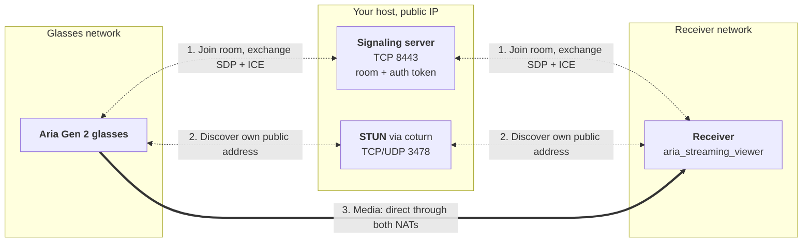
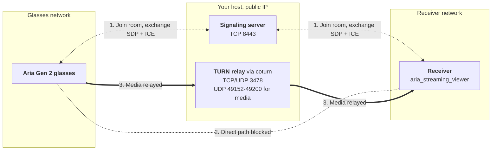

# Deploying a Signaling Server

Stand up the rendezvous server that lets Aria Gen2 glasses and a receiver find each
other when they are on **different networks**.

You only need this for cross-network WebRTC streaming. If the glasses and the receiver
are on the same network, `aria_streaming_viewer --transport webrtc --listen` connects
them directly and there is nothing to deploy — see
[WebRTC Streaming](/ark/client-sdk/webrtc).

## What you are deploying

Two independent pieces, and it is worth knowing which does what before you start:

| | What it does | Does media flow through it? |
|---|---|---|
| **Signaling server** | Introduces the two peers: matches them in a room, authenticates them, and passes SDP and ICE between them until they have negotiated a connection. | **No** |
| **STUN/TURN** (coturn) | STUN lets each peer discover its own public address. TURN relays the media when the two cannot reach each other directly. | **TURN: yes** |

Signaling is a small, almost idle process. TURN is the one that carries the session —
video, audio and the sensor data channel alike — so if you expect to fall back to it,
size and place that host accordingly. They are separate
daemons and do not have to live on the same machine, though the walkthrough below puts
them together because that is the simplest thing that works.

**Do you need TURN?** If both the glasses' network and the receiver's network allow
direct UDP between them, STUN alone is enough and the media never touches your server.
Behind symmetric NAT or a restrictive corporate firewall, it will not connect without
TURN. If you are unsure, deploy both — a TURN server that is never used costs nothing.

### The two media paths

Which one you get is decided at connection time by ICE, not by configuration: the peers try
direct first and fall back to the relay only when that fails. In both diagrams **dotted
arrows are signaling** — the SDP and ICE exchange, nothing else — and **thick arrows are
media**, the video, audio and sensor data channel. Media is DTLS-SRTP encrypted end to end
either way, including when TURN relays it.

**Signaling server + STUN — media goes direct.** The signaling server introduces the two
peers and STUN tells each one its own public address, which is enough for them to punch
through both NATs. Nothing but the introduction touches your host.



**TURN relay — media goes through your host.** Behind symmetric NAT or a restrictive
firewall the peers cannot reach each other directly, so both send their media to the TURN
server and it forwards each stream on. Signaling is unchanged; only the media path moves,
which is why this is the leg to size your host for.



## Where to run it

Anywhere both peers can reach: this is an ordinary Linux VPS from any provider — GCP,
AWS, Azure, DigitalOcean, Hetzner or your own hardware. There is nothing cloud-specific
in what follows.

**The smallest instance on offer is normally enough to start.** Signaling is a nearly
idle process — it passes a few small JSON envelopes per session and holds no media. A GCP
`e2-micro` has been enough in testing to run the signaling server *and* coturn together,
serving several concurrent rooms.

Scale up and the relay is what to watch. When sessions fall back to TURN, every relayed
stream crosses this host in both directions, so the load grows with the number of
concurrent relayed rooms and the bitrate of each. **Network bandwidth is the limit you
are likely to hit first**, ahead of CPU or memory. If you expect many concurrent rooms,
size the host for that throughput or run coturn on a separate machine. Deployments where
peers reach each other directly never load the host this way, because the media does not
touch it.

## Prerequisites

- A Linux host with **systemd** and **Python 3.9+**, reachable from both the glasses'
  network and the receiver's network. Debian and Ubuntu are what the commands below
  assume; any systemd distribution works with the equivalent package manager.
- A **public IP address** on that host, and the ability to open ports on it. On a cloud
  VM this usually means *two* firewalls: the host's own (`ufw`, `firewalld`) and your
  provider's security group. Both must allow the ports below.
- `sudo` on the host.
- [Client SDK installed](/ark/client-sdk/start) on the receiver computer, and glasses
  [authenticated](/ark/client-sdk/authentication) with it.

### Ports

| Port | Protocol | Purpose |
|---|---|---|
| 8443 | TCP | Signaling |
| 9443 | TCP | Signaling over TLS — only if you enable it, see [Optional: signaling over TLS](#signaling-over-tls-https) |
| 3478 | TCP + UDP | STUN/TURN — only if you deploy coturn |
| 49152–49200 | UDP | TURN relayed media — only if you deploy coturn |

## Install the signaling server

```bash
sudo apt-get update && sudo apt-get install -y python3-venv
sudo python3 -m venv /opt/aria-signaling
sudo /opt/aria-signaling/bin/pip install projectaria-webrtc-signaling-server
```

The server is pure Python standard library, so that install pulls no dependencies.

## Create an auth token

Both peers present this token to the signaling server. Generate it once and keep a copy
— you will pass the same value to the glasses and the receiver. The `install` line creates
the file empty, mode `0600` and owned by you, *before* anything is written to it: that is
what lets the unprivileged redirect write into root-owned `/etc/aria`, and it means the
secret is never briefly readable by other accounts.

```bash
sudo mkdir -p /etc/aria
sudo install -m 600 -o "$USER" /dev/null /etc/aria/auth.secret
openssl rand -hex 32 > /etc/aria/auth.secret
```

:::caution Never pass the token on the command line to the server
The server deliberately does not accept `--auth-token` as an argument, because argv is
readable by any local user through `ps` and `/proc/<pid>/cmdline`. Use
`--auth-token-file`, or the `ARIA_SIGNALING_AUTH_TOKEN` environment variable.
:::

## Install it as a service

```bash
sudo /opt/aria-signaling/bin/projectaria_webrtc_signaling_server \
  --install-service \
  --port 8443 \
  --auth-token-file /etc/aria/auth.secret
```

That writes `/etc/systemd/system/aria-signaling.service`, enables it and starts it, so
the server comes back after a reboot. `ExecStart` is rebuilt from the flags you just
passed, so the running service cannot drift from the command you typed.

Check it:

```bash
systemctl status aria-signaling
journalctl -u aria-signaling -f
```

Then open the signaling port, in the host firewall and in your provider's:

```bash
sudo ufw allow 8443/tcp
```

At this point signaling works. If you do not need TURN, skip to
[Verify the deployment](#verify-the-deployment).

## Add STUN/TURN (coturn)

```bash
sudo apt-get install -y coturn
TURN_PASSWORD="$(openssl rand -hex 16)"; echo "TURN password: $TURN_PASSWORD"
PUBLIC_IP="$(curl -fsS https://api.ipify.org)"; echo "Public IP: $PUBLIC_IP"
```

Write the config, substituting the two values printed above:

```bash
sudo tee /etc/turnserver.conf > /dev/null <<EOF
listening-port=3478
listening-ip=0.0.0.0
external-ip=${PUBLIC_IP}
realm=aria
user=aria:${TURN_PASSWORD}
lt-cred-mech
fingerprint
no-tls
no-dtls
min-port=49152
max-port=49200
log-file=/var/log/turnserver.log
simple-log
EOF

sudo sed -i 's/#TURNSERVER_ENABLED=1/TURNSERVER_ENABLED=1/' /etc/default/coturn
sudo systemctl enable --now coturn
sudo ufw allow 3478/tcp && sudo ufw allow 3478/udp && sudo ufw allow 49152:49200/udp
```

:::note `no-tls` / `no-dtls` do not make relayed media unencrypted
**Relayed media is still DTLS-encrypted.** These two options concern a different DTLS
association: they disable **TURN-over-TLS / TURN-over-DTLS**, which would encrypt the
*peer-to-coturn* leg of the TURN protocol itself, normally on port 5349.

The media's own encryption is negotiated **end to end between the glasses and the receiver**,
keyed from the certificate fingerprints exchanged in the SDP. When ICE selects a relayed
candidate, that DTLS handshake — and the SRTP and data-channel traffic it keys — simply
travels *through* coturn as opaque payload it forwards without ever holding a key.
Relaying changes which path the packets take, not whether they are encrypted.

So enabling TURN-over-TLS would wrap already-encrypted traffic in a second layer. The
reason to do it is to disguise relay traffic as HTTPS and get through restrictive
firewalls, not confidentiality.

What plain `3478` does expose to an on-path observer is the TURN control traffic itself:
that an allocation exists, and the peer and relay addresses inside it. Not the TURN
password — `lt-cred-mech` authenticates with an HMAC over a key derived from the
credential rather than sending it.
:::

:::note `external-ip` must be the address peers reach you on
On a cloud VM the interface usually holds a private address and the provider NATs a
public one onto it. coturn hands out candidates built from `external-ip`, so if this is
wrong every TURN candidate is unreachable and the connection silently fails to
establish. Check it matches what `curl https://api.ipify.org` returned from the host.
:::

### Optional: serve ICE config from the signaling server

Rather than passing `--stun` / `--turn` to every peer, you can configure them once on
the server and it will push them to both peers when they pair.

This reuses `PUBLIC_IP` and `TURN_PASSWORD` from the coturn step above. In a new shell they
are gone — read them back out of the config you just wrote:

```bash
PUBLIC_IP="$(sudo sed -n 's/^external-ip=//p' /etc/turnserver.conf)"
TURN_PASSWORD="$(sudo grep '^user=' /etc/turnserver.conf | cut -d: -f2)"
```

```bash
sudo tee /etc/aria/ice_servers.json > /dev/null <<EOF
[
  {"urls": "stun:${PUBLIC_IP}:3478"},
  {"urls": "turn:${PUBLIC_IP}:3478", "username": "aria", "credential": "${TURN_PASSWORD}"}
]
EOF
sudo chmod 600 /etc/aria/ice_servers.json

sudo /opt/aria-signaling/bin/projectaria_webrtc_signaling_server \
  --install-service \
  --port 8443 \
  --auth-token-file /etc/aria/auth.secret \
  --ice-servers /etc/aria/ice_servers.json
```

Re-running `--install-service` rewrites the unit in place. Server-pushed entries are
sent first, and any `--stun` / `--turn` a peer passes are added as fallback — the two
sources are additive, not exclusive.

:::caution This hands your TURN credential to every peer that pairs
The list is delivered inside the `paired` envelope, so it reaches anyone who can complete
the auth handshake and pair two peers in a room — which is exactly what two synthetic
peers do, as `smoke-test` demonstrates. It is not public, but it is no longer a separate
secret. Two consequences:

- **The signaling token becomes as valuable as the TURN password.** Configured per peer,
  the two are independent: a leaked signaling token buys rendezvous but no relay
  bandwidth. Served from here, one leaked secret grants both, and someone who extracts
  the credential can use your TURN server as an open relay for unrelated traffic. The
  `lt-cred-mech` credential set up above is long-term — it stays valid until you edit
  `/etc/turnserver.conf` and restart coturn. The server sends the JSON file verbatim and
  cannot mint short-lived TURN REST credentials, so rotation is manual.
- **The credential crosses the signaling channel, in cleartext unless it is behind TLS**
  (see [Security notes](#security-notes) and
  [Optional: signaling over TLS](#signaling-over-tls-https)). With
  per-peer `--turn-password` the credential is configured locally at each end and never
  travels over signaling at all.

Reasonable for a deployment where the same people already hold both secrets, and it is
the simplest thing that works. Prefer per-peer `--stun` / `--turn` flags when peer
operators should not get relay access, or when rotating the TURN credential is expensive.
:::

## Collect the connection details

Everything the peers need is on the signaling host. Run this block there and it prints the
values as ready-to-paste `export` lines — nothing to transcribe by hand. Copy its output
into the shell on the **receiver computer**, the same shell you will run
`aria_streaming_viewer` and `aria_gen2` from, and every command from here on runs as-is.

On the signaling host:

```bash
{
  echo "export SERVER_HOST=$(curl -fsS https://api.ipify.org)"
  echo "export AUTH_TOKEN=$(sudo cat /etc/aria/auth.secret)"
  [ -f /etc/turnserver.conf ]   && echo "export TURN_PASSWORD=$(sudo grep '^user=' /etc/turnserver.conf | cut -d: -f2)"
  [ -f /etc/aria/http2.secret ] && echo "export HTTP2_TOKEN=$(sudo cat /etc/aria/http2.secret)"
  echo "export ROOM=aria-demo"
  echo "export ROOM_PASSWORD=$(openssl rand -hex 12)"
}
```

It prints something like:

```
export SERVER_HOST=203.0.113.10
export AUTH_TOKEN=6f3b1d0c9a...
export TURN_PASSWORD=b74e21c8...
export ROOM=aria-demo
export ROOM_PASSWORD=9c1f47ab...
```

`SERVER_HOST` is the address the peers dial — the host's public IP, or its DNS name if you
have one, in which case substitute that. The `TURN_PASSWORD` line appears only if you
deployed coturn, and `HTTP2_TOKEN` only once you have set up
[signaling over TLS](#signaling-over-tls-https) — re-run the block after that step to pick
it up.

`ROOM` and `ROOM_PASSWORD` are the two values that are *not* read from the server: they are
yours to choose, and the block generates a fresh pair for convenience. Re-running it prints a
different `ROOM_PASSWORD`, so paste one output and stay with it. `ROOM` is what pairs the two
peers; `ROOM_PASSWORD` is what stops a third party who learns the room id from joining it.
Both ends must pass the same pair — the server matches the password exactly, and in both
directions, so a peer that omits it is treated as sending an empty one and will not join a
room that has one set.

If you have key-based SSH and passwordless `sudo` on the host, skip the copy-paste and run
the same block remotely, applying its output to your local shell in one step:

```bash
eval "$(ssh <host> bash -s <<'EOF'
echo "export SERVER_HOST=$(curl -fsS https://api.ipify.org)"
echo "export AUTH_TOKEN=$(sudo cat /etc/aria/auth.secret)"
[ -f /etc/turnserver.conf ]   && echo "export TURN_PASSWORD=$(sudo grep '^user=' /etc/turnserver.conf | cut -d: -f2)"
[ -f /etc/aria/http2.secret ] && echo "export HTTP2_TOKEN=$(sudo cat /etc/aria/http2.secret)"
echo "export ROOM=aria-demo"
echo "export ROOM_PASSWORD=$(openssl rand -hex 12)"
EOF
)"
```

## Verify the deployment

Before involving the glasses, check the server from the **receiver computer**. This
separates "server, firewall or token is wrong" from "glasses or TURN is wrong", which are
very hard to tell apart once you are looking at an empty viewer window.

```bash
export ARIA_SIGNALING_AUTH_TOKEN="$AUTH_TOKEN"
projectaria_webrtc_signaling_server smoke-test \
  --host "$SERVER_HOST" --port 8443 --room-password "$ROOM_PASSWORD"
```

The diagnostic reads the token from `ARIA_SIGNALING_AUTH_TOKEN`, so no local copy of the
secret file is needed; `--auth-token-file <path>` works too if you prefer one.

It connects two synthetic peers, authenticates them, pairs them and relays an envelope
between them — the same handshake the glasses perform, with no hardware involved.

A pass means signaling is healthy. It says nothing about whether media will flow: that
depends on STUN/TURN and the network between the peers.

## Connect the peers

Both ends point at the same host and the same room. With the variables exported above,
these run unmodified — start them in either order.

```bash
# Receiver computer
aria_streaming_viewer --transport webrtc \
    --signaling-host "$SERVER_HOST" --signaling-port 8443 \
    --room "$ROOM" --room-password "$ROOM_PASSWORD" \
    --auth-token "$AUTH_TOKEN" \
    --stun "stun:$SERVER_HOST:3478" \
    --turn "turn:$SERVER_HOST:3478" \
    --turn-username aria --turn-password "$TURN_PASSWORD"
```

```bash
# Glasses, over USB. --turn takes one comma-separated url,username,credential.
aria_gen2 streaming webrtc start \
    --signaling-url "tcp://$SERVER_HOST:8443" \
    --profile low_latency_streaming \
    --room "$ROOM" --room-password "$ROOM_PASSWORD" \
    --auth-token "$AUTH_TOKEN" \
    --stun "stun:$SERVER_HOST:3478" \
    --turn "turn:$SERVER_HOST:3478,aria,$TURN_PASSWORD" \
    --interface wifi_sta
```

Drop the STUN/TURN flags on both sides if you did not deploy coturn.

## Signaling over TLS (HTTPS)

Optional, but **strongly recommended** for any deployment reachable from an untrusted
network. The listener configured above speaks plain TCP, in the clear. The server can
also bind a **second** listener that speaks the same protocol over HTTP/2 inside TLS,
which a peer reaches with an `https://` signaling URL. Both listeners share one relay, so
peers pair with each other whichever one they arrive on, and you can move one end at a
time.

The plain TCP listener sends everything the peers exchange in the clear: the room id and
password, the auth handshake, session ids, and the SDP — which includes the ICE candidates
carrying both peers' addresses, and the DTLS fingerprints they use to authenticate each
other's media keys. TLS gives that exchange confidentiality and integrity. Media
encryption is unaffected either way; it is negotiated separately between the peers.

:::note A DNS name is not required
You do not need a domain. This deployment is designed to work on a **bare public IP**
with a self-signed certificate: a peer pointed at your own CA anchor skips the hostname
check, because the anchor *is* the identity — you issued exactly one certificate with it.
Keep such a CA single-purpose, since anything else it ever signs would be accepted for
your signaling server too.
:::

### 1. Install the HTTP/2 extra

The base server is pure standard library. The TLS listener needs one dependency,
[hypercorn](https://pypi.org/project/hypercorn/), which serves the HTTP/2 endpoint; the
`[http2]` extra pulls it in.

```bash
sudo /opt/aria-signaling/bin/pip install "projectaria-webrtc-signaling-server[http2]"
```

### 2. Generate a self-signed certificate

Generate it on the server, so the private key never travels. Ask the internet what this
host looks like from outside — on a cloud VM behind NAT that is not what `hostname -I`
reports:

```bash
export SERVER_HOST=$(curl -s https://api.ipify.org)
echo "$SERVER_HOST"      # the same value you collected above; the peers need it too
```

The SAN type has to match what `SERVER_HOST` holds — `openssl` rejects a DNS name given
as `IP:`. Peers carrying your anchor skip the hostname check, but `openssl` and `curl` do
check it when you verify by hand, so it is worth setting:

```bash
export SAN="IP:$SERVER_HOST"          # for a DNS name: export SAN="DNS:$SERVER_HOST"

openssl req -x509 -newkey rsa:4096 -nodes -days 3650 \
  -subj "/CN=aria-signaling" -addext "subjectAltName=$SAN" \
  -keyout server.key -out server.pem

sudo install -m 600 -o "$USER" server.key /etc/aria/server.key
sudo install -m 644 -o "$USER" server.pem /etc/aria/server.pem
```

`server.pem` is both the server's certificate and the anchor the peers will verify
against — a self-signed certificate is its own CA. It is the only file that leaves the
host.

### 3. Create a token for this listener

Peers on the TLS listener authenticate with a **bearer token**, presented inside the TLS
session. They do not perform the HMAC handshake the TCP listener uses, so give it its
own secret:

```bash
sudo install -m 600 -o "$USER" /dev/null /etc/aria/http2.secret
openssl rand -hex 32 > /etc/aria/http2.secret
echo "export HTTP2_TOKEN=$(cat /etc/aria/http2.secret)"
```

That prints one more `export` line, in the same form as the ones from
[Collect the connection details](#collect-the-connection-details) — paste it into the shell
on the receiver computer alongside the others and the TLS commands below run as-is. The
collect block picks this token up too, now that the file exists.

### 4. Reinstall the service with the TLS flags

Re-running `--install-service` rewrites the unit in place, keeping the plain-TCP
listener and adding the TLS one:

```bash
sudo /opt/aria-signaling/bin/projectaria_webrtc_signaling_server \
  --install-service \
  --port 8443 \
  --auth-token-file /etc/aria/auth.secret \
  --http2-port 9443 \
  --http2-tls-cert /etc/aria/server.pem \
  --http2-tls-key /etc/aria/server.key \
  --http2-auth-token-file /etc/aria/http2.secret

sudo ufw allow 9443/tcp
```

`9443` is a high port, so the service account can bind it without root. Binding `443`
instead would need root or `CAP_NET_BIND_SERVICE`.

:::caution Adding TLS to an already-running service? Restart it
`--install-service` rewrites the unit and then *starts* it, which is a no-op when the
service is already running — so the old process stays up on the old ports and none of
the flags above take effect. `sudo systemctl restart aria-signaling`, then confirm with
`sudo ss -lntp | grep -E ':8443|:9443'` that both are actually bound.
:::

### 5. Verify the listener

Point `openssl` at your anchor with `-CAfile`. It is not optional — without it `openssl`
does not know your CA and reports `Verify return code: 18` for a perfectly good server:

```bash
openssl s_client -connect "$SERVER_HOST:9443" -alpn h2 -CAfile /etc/aria/server.pem \
  </dev/null 2>&1 | grep -E "Verify return code|ALPN protocol"
```

Expect `Verify return code: 0 (ok)` and `ALPN protocol: h2`. `ALPN protocol: none` is the
one to act on — peers will fail against it with an opaque connect error.

### 6. Point the receiver at it

Copy the certificate to the receiver computer and name it as the trust anchor. Only the
certificate travels; the key stays on the server.

```bash
scp "$SERVER_HOST":/etc/aria/server.pem ~/aria-signaling-ca.pem

aria_streaming_viewer --transport webrtc \
    --signaling-url "https://$SERVER_HOST:9443" \
    --ca-root ~/aria-signaling-ca.pem \
    --room "$ROOM" --room-password "$ROOM_PASSWORD" \
    --auth-token "$HTTP2_TOKEN" \
    --stun "stun:$SERVER_HOST:3478" \
    --turn "turn:$SERVER_HOST:3478" \
    --turn-username aria --turn-password "$TURN_PASSWORD"
```

`--ca-root` must name the certificate you just copied — it is what the receiver verifies
the server against, so passing it is required. Do not reach for
`--no-verify-server-certs` instead: it turns verification off entirely and accepts any
certificate, including an attacker's, which is why it is rejected for anything but a
loopback signaling host (`localhost`, `127.0.0.1`, `::1`). Your deployment is trusted
with `--ca-root`, not by turning verification off.

TLS changes the signaling channel only. The STUN/TURN flags are exactly the ones the
plain-TCP listener takes and coturn is untouched by any of it, so drop them here too if you
did not deploy coturn.

### 7. Point the glasses at the TLS listener

The glasses take their trust anchor from a certificate set installed on it rather than from
a flag on the streaming command. The set also carries a publisher certificate and key,
which signaling does not use but the installer requires, so generate a throwaway pair for
them:

```bash
openssl req -x509 -newkey rsa:2048 -nodes -days 3650 \
  -keyout node.key -out node.pem -subj "/CN=aria-node-dummy"

aria_gen2 streaming install-certs user-defined-certs \
  --ca-root ~/aria-signaling-ca.pem \
  --cert    node.pem \
  --key     node.key \
  --cert-name default
```

`--cert-name` must be `default` — the glasses read that set and no other, so any other
name installs successfully and is then silently ignored. `--cert` and `--key` are required
even though only the root matters here.

With no anchor installed, the glasses **refuse** to start an `https://` session rather
than falling back to a built-in certificate it cannot authenticate, and says which path
it looked in. Note what the anchor buys: the glasses trust the *issuer*, not the identity,
which is the other reason to keep this CA single-purpose.

Then start the glasses against the TLS listener:

```bash
aria_gen2 streaming webrtc start \
    --signaling-url "https://$SERVER_HOST:9443" \
    --profile low_latency_streaming \
    --room "$ROOM" --room-password "$ROOM_PASSWORD" --auth-token "$HTTP2_TOKEN" \
    --stun "stun:$SERVER_HOST:3478" \
    --turn "turn:$SERVER_HOST:3478,aria,$TURN_PASSWORD" \
    --interface wifi_sta
```

As on the receiver, drop the STUN/TURN flags if you did not deploy coturn.

### Behind a TLS-terminating proxy

If nginx, Caddy or a cloud load balancer already terminates TLS for you, drop
`--http2-tls-cert`/`--http2-tls-key` and pass `--http2-trust-proxy-tls` — it tells the
server that an edge is doing the encryption, so it will bind a cleartext HTTP/2 listener
on a routable address instead of refusing to. The proxy must forward **HTTP/2 cleartext
(h2c)** upstream; a proxy that downgrades to HTTP/1.1 will not work, because the
signaling endpoint is a long-lived streaming POST that depends on HTTP/2 framing.

## Troubleshooting

| Symptom | Likely cause |
|---|---|
| `smoke-test` cannot reach the host at all | Port 8443 is closed. Check the host firewall *and* your provider's security group — they are separate, and the provider's cannot be configured from inside the VM. |
| `smoke-test` connects, then times out | Something is listening but it is not the signaling server, or a proxy sits in front of it. Check `journalctl -u aria-signaling`. |
| Server logs `auth_rejected` with a timestamp skew | The glasses' clock has drifted outside the freshness window. Add `--ntp-sync` to the glasses command so it syncs before the session starts. |
| Server logs `register: room '<id>' password mismatch; rejecting peer` | The two peers presented different `--room-password` values, or one of them omitted it. The match is exact and in both directions, so setting it on one side only fails too. A room also keeps the first password it saw until both peers leave, so a stale room from an earlier run with a different secret will reject you — reconnect with the original value, or pick a fresh `--room`. |
| Peers pair, but no video arrives | Signaling is fine and this is a media path problem: TURN is missing, `external-ip` in `turnserver.conf` is wrong, or the UDP relay range is not open. |
| Receiver on an `https://` URL logs `SSL connect error` and retries | The certificate does not chain to the anchor `--ca-root` names — check you copied `server.pem` from this deployment and not an older one — or the host is unreachable on the TLS port, or an HTTP proxy in the receiver's environment (`https_proxy`) is intercepting the connection; add the signaling host to `no_proxy`. |
| `--install-service` refuses to run | It is Linux-only, needs root, and will not inline a secret — it refuses if the token comes from `ARIA_SIGNALING_AUTH_TOKEN` rather than a file. |

## Security notes

- The auth token gates who can use your server. Treat it as a shared secret; rotate it
  by writing a new value to `/etc/aria/auth.secret` and restarting the service.
- Room passwords are enforced by the server: the first peer into a room fixes the
  password, and later peers must present the same one. They gate the room, not the
  server — the auth token is what decides who may connect at all.
- The plain-TCP auth handshake is range-checked against the server clock —
  `--auth-freshness-window` seconds, 60 by default — so a captured handshake stops
  replaying once it ages out. For a fleet that genuinely cannot keep its clocks synced,
  `--auth-freshness-window 0` accepts any timestamp and the server warns at startup; that
  leaves a captured handshake replayable indefinitely, so set a room password, restrict
  who can reach the signaling port, and prefer TLS.
- The generated unit is mode `0600` because its `ExecStart` names the token file path.
- `--ice-servers` widens what the auth token is worth: the list, including any TURN
  username and credential in it, is sent to both peers in the `paired` envelope. Rotate
  the TURN credential together with the auth token, and skip the option if peers should
  not have relay access — see
  [Optional: serve ICE config from the signaling server](#optional-serve-ice-config-from-the-signaling-server).
- **Media is encrypted regardless of any of the above.** WebRTC negotiates DTLS-SRTP and
  verifies the peer's self-signed certificate against the fingerprint carried in the SDP,
  so video and audio are protected end to end whether or not TURN relays them.
- **The signaling channel is cleartext TCP by default.** What protects it then is the
  HMAC auth handshake, which never puts the token on the wire and is bound to a timestamp
  inside the freshness window, plus the room password. That stops an eavesdropper from
  joining, but not an on-path attacker from reading or altering SDP. Put the channel
  behind TLS to close that gap — see
  [Signaling over TLS](#signaling-over-tls-https). Either way, treat the signaling host as
  you would any other service exposed to the internet: it sees room ids and SDP, not
  media.
