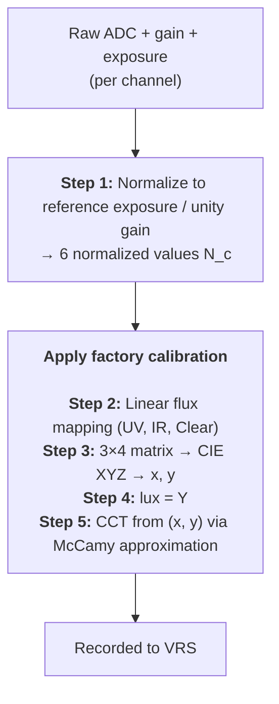

# Aria Gen2 Ambient Light Sensor (ALS)

A reference for researchers and developers working with ALS data from Aria Gen2 recordings. It covers the sensor itself, the on-device processing pipeline, what is stored in VRS, and how to read the data and factory calibration with [`projectaria_tools`](https://github.com/facebookresearch/projectaria_tools) (PAT).

---

## 1. Sensor overview

Aria Gen2 uses the **STMicroelectronics VD6281** RGB-IR-Clear-UV ambient light sensor. It is a 6-channel multispectral sensor with channels:

| Channel | Approximate peak | Notes |
| --- | --- | --- |
| **Red** | ~620 nm | Color channel |
| **Green** | ~545 nm | Color channel |
| **Blue** | ~465 nm | Color channel |
| **UV** | ~370 nm | Ultraviolet (UV-A region) |
| **IR** | ~850 nm | Near-infrared |
| **Clear** | broadband | No color filter, for illuminance |

Each channel has its own optical filter and photodiode. The 6 channels are sampled simultaneously per frame.

**Per-channel spectral response curves** $S_c(\lambda)$ — the wavelength-dependent sensitivity of each filtered photodiode — are a property of the sensor hardware itself and are documented in the **ST VD6281 datasheet**. The datasheet is not openly distributed by ST; please contact ST (or your sales/FAE) to obtain a copy. Refer to the datasheet for the exact curve shapes.

**Sample rate**: nominally **10 Hz** (configurable on-device).

---

## 2. Raw hardware output

For each frame, the sensor produces, for each channel $c$ independently:

| Quantity | Type | Description |
| --- | --- | --- |
| $\text{ADC}_c$ | 24-bit (U16.8) | Integrated photocurrent over the exposure window. Internally represented as 16 integer bits + 8 fractional bits. |
| $g_c$ | 4-bit (1..15) | Analog gain register code, mapping to one of 15 fixed gain values (see [Normalization](#normalization)). |
| $r_e$ | 10-bit | Exposure time register code. The actual exposure time in microseconds is $t_e = r_e \times 1600\ \mu s$. |

Each channel has its **own** programmable gain $g_c$ — the sensor can use different gain settings on different channels to handle color sources where some channels would saturate faster than others.

**The fundamental sensor equation** (forward model):

$$
\text{ADC}_c = \text{ChipGain}(g_c) \cdot \int I(\lambda) \cdot S_c(\lambda)\, d\lambda \cdot t_e
$$

where $I(\lambda)$ is the spectral irradiance of the incident light. The sensor integrates the spectrum × filter response over the exposure window and reports the result as a 24-bit count.

---

## 3. On-device processing pipeline

Before data is recorded, the device firmware applies the following processing to each frame:



### 3.1 Step 1 — Normalization (no calibration involved) {#normalization}

$$
\boxed{\quad N_c = \frac{100{,}800\ \mu s}{t_e} \cdot \frac{\text{ADC}_c}{G[g_c]} \quad}
$$

where:

- $t_e$ is the actual exposure time in µs
- $G[g_c]$ is the analog gain value, looked up from the 15-entry table below

The constant $100{,}800\ \mu s$ is the manufacturer's "reference exposure". The result $N_c$ is the equivalent signal as if the sample had been taken at that reference exposure with unity gain — making samples comparable across frames with different gain or exposure.

**Gain lookup table** $G[g]$ (indices 1..15):

| idx | $G[g]$ | idx | $G[g]$ | idx | $G[g]$ |
| :-: | :-: | :-: | :-: | :-: | :-: |
| 1 | 66.67 | 6 | 10.0 | 11 | 1.67 |
| 2 | 50.0 | 7 | 7.14 | 12 | 1.25 |
| 3 | 33.3 | 8 | 5.0 | 13 | 1.0 |
| 4 | 25.0 | 9 | 3.33 | 14 | 0.83 |
| 5 | 16.67 | 10 | 2.5 | 15 | 0.71 |

### 3.2 Step 2 — Linear flux mapping (uses calibration)

For the three flux-reporting channels (UV, IR, Clear), an affine transform maps the normalized signal to an irradiance value in W/m²:

$$
\boxed{\quad \Phi_k = \alpha_k \cdot N_k + \beta_k\ \ [\text{W/m}^2], \qquad k \in \{\text{UV},\, \text{IR},\, \text{Clear}\} \quad}
$$

The coefficients $\alpha_k, \beta_k$ come from the factory calibration (see [Factory calibration: contents and usage](#factory-calibration)).

### 3.3 Steps 3–5 — Lux and CCT (uses calibration)

A factory-calibrated $3{\times}4$ matrix $M$ and 3-element offset vector $\mathbf{o}$ map four normalized channels (R, G, B, IR) into CIE XYZ tristimulus values:

$$
\begin{bmatrix} X \\ Y \\ Z \end{bmatrix} =
\underbrace{\begin{bmatrix} m_{00} & m_{01} & m_{02} & m_{03} \\ m_{10} & m_{11} & m_{12} & m_{13} \\ m_{20} & m_{21} & m_{22} & m_{23} \end{bmatrix}}_{M}
\begin{bmatrix} N_R \\ N_G \\ N_B \\ N_I \end{bmatrix} + \mathbf{o}
$$

CIE chromaticity coordinates:

$$
x = \frac{X}{X+Y+Z}, \qquad y = \frac{Y}{X+Y+Z}
$$

**Illuminance** (in lux) — directly the Y tristimulus, since the matrix $M$ is fit to absorb the V(λ) photopic weighting:

$$
\boxed{\quad L = \max(Y, 0)\ \ [\text{lux}] \quad}
$$

**Correlated color temperature** (in Kelvin) — McCamy's 1992 cubic approximation:

$$
n = \frac{x - 0.3320}{0.1858 - y}
$$

$$
\boxed{\quad T_{cc} = \max\!\Big(449\,n^3 + 3525\,n^2 + 6823.3\,n + 5520.33,\ 0\Big)\ \ [\text{K}] \quad}
$$

This approximation is most accurate in the 2856 K – 6500 K range (incandescent through daylight).

:::note A note on the matrix $M$
It is a least-squares linear fit of $(N_R, N_G, N_B, N_I) \to (X, Y, Z)$ trained against a set of standard calibration illuminants. It works well for typical broadband / "white" light sources. For narrow-band or unusual spectra (single-wavelength LEDs, lasers, line-emission lamps), the linear approximation breaks down because metameric spectra that differ from the calibration set are not captured. For such cases, you should work from the raw $N_c$ values combined with the sensor's spectral response curves $S_c(\lambda)$ from the ST datasheet.
:::

### 3.4 Auto-exposure {#auto-exposure}

The firmware runs an **on-device auto-exposure controller (AEC)** that adjusts the exposure time on a per-sample basis to keep the brightest of the (R, G, B) channels in a healthy mid-range, well below the ADC saturation point. **Channel gains are not adjusted by the AEC** — they remain at fixed initial values for the lifetime of the recording.

Key consequences for users:

- `exposureTimeUs` **varies per frame** in the range 1600 µs – 92800 µs. This is normal and expected.
- **All `gain*` fields are effectively constant** across an entire recording: `(gainRed, gainGreen, gainBlue, gainUv, gainIr, gainClear) = (1.0, 1.0, 1.0, 16.67, 1.0, 1.0)`.
- **Usable dynamic range** is roughly 1 lux to ~20,000+ lux.
- **Per-sample coherence is preserved**: the `exposureTimeUs` recorded for a given sample is exactly the exposure that was used to capture that sample. Auto-exposure changes only take effect on the *next* sample. The reverse-engineering formula in [Recovering raw ADC counts](#recovering-raw-adc-counts) is therefore exact.

If you need to detect frames that are saturated or at the AEC's exposure rails, see [Detecting clipped / saturated samples](#detecting-saturated-samples).

---

## 4. Factory calibration: contents and usage {#factory-calibration}

Each Aria Gen2 device is calibrated at the factory. The ALS-specific portion of the calibration is a JSON block with four entries:

| JSON key | Type | Used for | Coefficient count |
| --- | --- | --- | --- |
| `rgb` | array of 12 or 15 floats | Lux and CCT (matrix $M$ and offset $\mathbf{o}$) | $3 \times 4$ matrix + 3 offsets = 15 (legacy: 12, IR column omitted) |
| `uv` | array of 2 floats | UV flux (W/m²) | $(\alpha_{\text{UV}}, \beta_{\text{UV}})$ |
| `ir` | array of 2 floats | IR flux (W/m²) | $(\alpha_{\text{IR}}, \beta_{\text{IR}})$ |
| `clear` | array of 2 floats | Clear flux (W/m²) | $(\alpha_{\text{Clear}}, \beta_{\text{Clear}})$ |

**Layout of the `rgb` array** (15-element form, row-major):

```text
M_row_0 (X): [ m00, m01, m02, m03, o_X ]
M_row_1 (Y): [ m10, m11, m12, m13, o_Y ]
M_row_2 (Z): [ m20, m21, m22, m23, o_Z ]
```

The first 4 entries of each row are the matrix coefficients for (R, G, B, IR); the 5th entry is the offset for that row. In the 12-element legacy form there are only 4 columns (no IR column); the IR column is taken to be zero.

**Where to find it**: the calibration is embedded as a JSON string inside every Aria Gen2 VRS recording, in the `factory_calibration` field of each sensor stream's configuration record. See [Reading factory calibration with PAT](#reading-factory-calibration) for how to read it.

**On-device use**: the firmware uses these coefficients to compute lux, CCT, and the three flux values **before** writing them to VRS. Researchers do not need to re-apply the calibration to get lux/CCT/flux. The coefficients are useful if you want to:

- Recompute lux/CCT/flux from the recorded normalized channels (for verification),
- Apply your own custom transform from the 6 channels to derived quantities,
- Understand the relationship between raw channels and the cooked outputs.

---

## 5. What is stored in VRS

Each ALS sample in the VRS file contains the following fields:

| Field | Type | Unit | Description |
| --- | --- | --- | --- |
| `captureTimestampNs` | int64 | ns | Capture timestamp (device monotonic clock) |
| `redChannelNormalized` | float | unitless | $N_R$ — normalized red channel |
| `greenChannelNormalized` | float | unitless | $N_G$ — normalized green channel |
| `blueChannelNormalized` | float | unitless | $N_B$ — normalized blue channel |
| `uvChannelNormalized` | float | unitless | $N_{\text{UV}}$ — normalized UV channel |
| `irChannelNormalized` | float | unitless | $N_{\text{IR}}$ — normalized IR channel |
| `clearChannelNormalized` | float | unitless | $N_{\text{Clear}}$ — normalized clear channel |
| `uvFluxWattPerSquareMeter` | float | W/m² | $\Phi_{\text{UV}}$ — UV irradiance |
| `irFluxWattPerSquareMeter` | float | W/m² | $\Phi_{\text{IR}}$ — IR irradiance |
| `clearFluxWattPerSquareMeter` | float | W/m² | $\Phi_{\text{Clear}}$ — broadband irradiance |
| `gainRed` | float | unitless | Analog gain on red channel |
| `gainGreen` | float | unitless | Analog gain on green channel |
| `gainBlue` | float | unitless | Analog gain on blue channel |
| `gainUv` | float | unitless | Analog gain on UV channel |
| `gainIr` | float | unitless | Analog gain on IR channel |
| `gainClear` | float | unitless | Analog gain on clear channel |
| `exposureTimeUs` | uint32 | µs | Exposure time used for this frame; **varies per-sample** in 1600–92800 due to on-device auto-exposure (see [Auto-exposure](#auto-exposure)) |
| `cct` | float | K | Correlated color temperature |
| `lux` | float | lux | Illuminance |

:::info
All six `gain*` fields are effectively constant across an Aria Gen2 recording — see [Auto-exposure](#auto-exposure).
:::

:::info
The PAT API also exposes three `visible*` fields (`visibleChannelNormalized`, `visibleFluxWattPerSquareMeter`, `gainVisible`) for cross-product schema compatibility. **On Aria Gen2 these are always 0 and can be ignored.**
:::

---

## 6. Reading ALS data with projectaria_tools (PAT)

### 6.1 Basic iteration

```python
from projectaria_tools.core import data_provider
from projectaria_tools.core.stream_id import StreamId

provider = data_provider.create_vrs_data_provider("recording.vrs")
als_sid  = provider.get_stream_id_from_label("als")

# Total number of ALS samples
num_samples = provider.get_num_data(als_sid)
print(f"ALS samples: {num_samples}")

# Read one sample
sample = provider.get_als_data_by_index(als_sid, 0)
print(f"timestamp_ns = {sample.capture_timestamp_ns}")
print(f"lux          = {sample.lux:.2f}")
print(f"cct          = {sample.cct:.0f} K")
print(f"exposure_us  = {sample.exposure_time_us}")
print(f"gain (RGB)   = {sample.gain_red:.2f}, "
                       f"{sample.gain_green:.2f}, "
                       f"{sample.gain_blue:.2f}")
print(f"normalized   = R:{sample.red_channel_normalized:.1f}  "
                      f"G:{sample.green_channel_normalized:.1f}  "
                      f"B:{sample.blue_channel_normalized:.1f}  "
                      f"UV:{sample.uv_channel_normalized:.1f}  "
                      f"IR:{sample.ir_channel_normalized:.1f}  "
                      f"C:{sample.clear_channel_normalized:.1f}")
print(f"flux W/m²    = UV:{sample.uv_flux_watt_per_square_meter:.4f}  "
                      f"IR:{sample.ir_flux_watt_per_square_meter:.4f}  "
                      f"C:{sample.clear_flux_watt_per_square_meter:.4f}")
```

### 6.2 Verify lux and CCT (sanity check)

Once you have the calibration matrix (see [Reading factory calibration with PAT](#reading-factory-calibration)), you can recompute lux and CCT from the normalized channels and compare to the recorded values. They should agree to within float precision.

```python
import numpy as np

def compute_lux_cct(N_R, N_G, N_B, N_I, M, offsets):
    """Apply factory calibration matrix to derive lux and CCT."""
    XYZ = M @ np.array([N_R, N_G, N_B, N_I]) + offsets
    X, Y, Z = XYZ
    total = X + Y + Z
    if total <= 0:
        return 0.0, 0.0
    x, y = X / total, Y / total
    lux = max(Y, 0.0)
    n   = (x - 0.3320) / (0.1858 - y)
    cct = max(((449 * n + 3525) * n + 6823.3) * n + 5520.33, 0.0)
    return lux, cct

lux_recomputed, cct_recomputed = compute_lux_cct(
    sample.red_channel_normalized, sample.green_channel_normalized,
    sample.blue_channel_normalized, sample.ir_channel_normalized,
    M, offsets)
assert abs(lux_recomputed - sample.lux) < 1e-3
assert abs(cct_recomputed - sample.cct) < 1e-1
```

### 6.3 Iterate all samples into a NumPy array

```python
import numpy as np

n  = provider.get_num_data(als_sid)
ts = np.zeros(n, dtype=np.int64)
lux = np.zeros(n, dtype=np.float32)
cct = np.zeros(n, dtype=np.float32)
normalized = np.zeros((n, 6), dtype=np.float32)  # R, G, B, UV, IR, Clear

for i in range(n):
    s = provider.get_als_data_by_index(als_sid, i)
    ts[i] = s.capture_timestamp_ns
    lux[i] = s.lux
    cct[i] = s.cct
    normalized[i] = [s.red_channel_normalized,   s.green_channel_normalized,
                     s.blue_channel_normalized,  s.uv_channel_normalized,
                     s.ir_channel_normalized,    s.clear_channel_normalized]
```

---

## 7. Reading factory calibration with PAT {#reading-factory-calibration}

The factory calibration JSON is embedded into every sensor stream's configuration record. You can read it from any stream (image, IMU, ALS, etc.) — all streams in a recording carry an identical copy.

```python
import json
from projectaria_tools.core import data_provider

provider = data_provider.create_vrs_data_provider("recording.vrs")

# Read from any sensor stream's configuration
rgb_sid = provider.get_stream_id_from_label("camera-rgb")
cfg     = provider.get_image_configuration(rgb_sid)
factory_cal = json.loads(cfg.factory_calibration)

als_cal = factory_cal["als"]
rgb_coeffs = als_cal["rgb"]          # 12 or 15 floats
uv_cal     = als_cal["uv"]           # [alpha_UV, beta_UV]
ir_cal     = als_cal["ir"]           # [alpha_IR, beta_IR]
clear_cal  = als_cal["clear"]        # [alpha_Clear, beta_Clear]

import numpy as np
if len(rgb_coeffs) == 15:
    full = np.array(rgb_coeffs).reshape(3, 5)
    M       = full[:, :4]            # 3x4 calibration matrix
    offsets = full[:, 4]             # 3-element offset vector
else:                                # legacy 12-coefficient format
    M        = np.zeros((3, 4))
    M[:, :3] = np.array(rgb_coeffs).reshape(3, 4)[:, :3]
    M[:, 3]  = 0.0                   # IR column = 0
    offsets  = np.array(rgb_coeffs).reshape(3, 4)[:, 3]

print(f"3x4 matrix M:\n{M}")
print(f"offsets:    {offsets}")
print(f"UV    cal:  alpha = {uv_cal[0]},    beta = {uv_cal[1]}")
print(f"IR    cal:  alpha = {ir_cal[0]},    beta = {ir_cal[1]}")
print(f"Clear cal:  alpha = {clear_cal[0]}, beta = {clear_cal[1]}")
```

You can then use the calibration to verify flux values:

```python
def expect_close(name, expected, actual, tol=1e-5):
    assert abs(expected - actual) < tol, f"{name}: {expected} vs {actual}"

alpha_U, beta_U = uv_cal
alpha_I, beta_I = ir_cal
alpha_C, beta_C = clear_cal

expect_close("UV flux",
             alpha_U * sample.uv_channel_normalized + beta_U,
             sample.uv_flux_watt_per_square_meter)
expect_close("IR flux",
             alpha_I * sample.ir_channel_normalized + beta_I,
             sample.ir_flux_watt_per_square_meter)
expect_close("Clear flux",
             alpha_C * sample.clear_channel_normalized + beta_C,
             sample.clear_flux_watt_per_square_meter)
```

---

## 8. (Optional) Recovering raw ADC counts {#recovering-raw-adc-counts}

Although VRS stores normalized values rather than raw ADC counts, the raw counts can be reconstructed by inverting the normalization formula in [Normalization](#normalization):

$$
\boxed{\quad \text{ADC}_c = \frac{N_c \cdot G[g_c] \cdot t_e}{100{,}800} \quad}
$$

```python
LUT_GAIN = [66.67, 50.0, 33.3, 25.0, 16.67, 10.0, 7.14, 5.0,
            3.33, 2.5, 1.67, 1.25, 1.0, 0.83, 0.71]

def gain_to_index(g):
    """Map the float gain stored in VRS back to the 1..15 index."""
    return min(range(15), key=lambda i: abs(LUT_GAIN[i] - g)) + 1

# Internal-precision gain values (8.8 fixed-point used by the on-device driver)
LUT_GAIN_EXACT_HEX = [0x42AB, 0x3200, 0x2154, 0x1900, 0x10AB, 0x0A00,
                      0x0723, 0x0500, 0x0354, 0x0280, 0x01AB, 0x0140,
                      0x0100, 0x00D4, 0x00B5]

def exact_gain(idx):
    return LUT_GAIN_EXACT_HEX[idx - 1] / 256.0

def recover_raw_adc(N_c, gain_float, exposure_us):
    """Returns the 24-bit U16.8 raw ADC representation used by the driver.
    Approximate 16-bit ADC count: int(result) >> 8.
    """
    idx = gain_to_index(gain_float)
    G   = exact_gain(idx)
    return N_c * G * exposure_us / 100_800.0

t_e = sample.exposure_time_us
adc_red   = recover_raw_adc(sample.red_channel_normalized,   sample.gain_red,   t_e)
adc_green = recover_raw_adc(sample.green_channel_normalized, sample.gain_green, t_e)
adc_blue  = recover_raw_adc(sample.blue_channel_normalized,  sample.gain_blue,  t_e)
adc_uv    = recover_raw_adc(sample.uv_channel_normalized,    sample.gain_uv,    t_e)
adc_ir    = recover_raw_adc(sample.ir_channel_normalized,    sample.gain_ir,    t_e)
adc_clear = recover_raw_adc(sample.clear_channel_normalized, sample.gain_clear, t_e)
```

**Precision note**: the on-device firmware casts the normalized value from a 64-bit fixed-point representation to float32 before recording. This is the only precision-loss step in the entire pipeline:

- For typical indoor illuminance, reconstructed ADC values are accurate to integer level.
- For bright outdoor or near-sun readings (normalized values approaching $5.8 \times 10^6$), up to ~14 bits of fractional precision are lost.

If you require bit-exact raw counts, please contact the Aria team — that would require a firmware change to also emit the underlying fixed-point value.

### 8.1 Detecting clipped / saturated samples {#detecting-saturated-samples}

The device does **not** record an explicit saturation flag per sample. If your analysis is sensitive to channel saturation (e.g. characterizing bright outdoor scenes), it is recommended to derive one yourself from the reconstructed raw ADC and the sensor's documented saturation rate of approximately **145.636 ADC counts / µs** (with an 80% safety margin applied by the on-device AEC):

```python
SAT_RATE_ADC_PER_US = 145.636
SAFETY_MARGIN       = 0.80

def sample_quality(sample):
    t_e = sample.exposure_time_us
    sat_threshold = SAT_RATE_ADC_PER_US * t_e * SAFETY_MARGIN
    raw_R = recover_raw_adc(sample.red_channel_normalized,   sample.gain_red,   t_e)
    raw_G = recover_raw_adc(sample.green_channel_normalized, sample.gain_green, t_e)
    raw_B = recover_raw_adc(sample.blue_channel_normalized,  sample.gain_blue,  t_e)
    raw_I = recover_raw_adc(sample.ir_channel_normalized,    sample.gain_ir,    t_e)
    return {
        'rgb_saturated':  max(raw_R, raw_G, raw_B) > sat_threshold,
        'ir_saturated':   raw_I > sat_threshold,
        'aec_at_min_exp': t_e <= 1600,    # scene may be brighter than the device can resolve
        'aec_at_max_exp': t_e >= 92800,   # scene may be darker than the device can resolve
    }
```

Use this to filter out frames at the edges of the sensor's dynamic range before downstream analysis.

---

## 9. Live streaming

Live streaming of ALS data is **not currently supported** for external users. If real-time ALS streaming is required for your work, please contact us at [AriaOps@meta.com](mailto:AriaOps@meta.com) to discuss your use case.

:::note Version requirements
`projectaria_tools` **≥ 2.1.4** is required for the `gain*` and `exposureTimeUs` fields to read back correctly. Earlier versions had a schema-type mismatch that caused these fields to silently return 0. Please upgrade if your installed version is older.
:::

---

## 10. References

**Sensor datasheet**

- STMicroelectronics VD6281 (not openly distributed by ST; contact ST or your sales/FAE to request a copy)

**projectaria_tools** (Apache 2.0, open source)

- [GitHub repository](https://github.com/facebookresearch/projectaria_tools)
- [API reference](https://facebookresearch.github.io/projectaria_tools/)

**Standards and references**

- CIE 1931 colorimetry (X, Y, Z tristimulus and chromaticity)
- McCamy, C. S. (1992). "Correlated color temperature as an explicit function of chromaticity coordinates." *Color Research & Application*, 17(2), 142–144.
